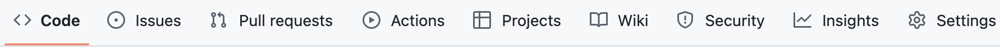
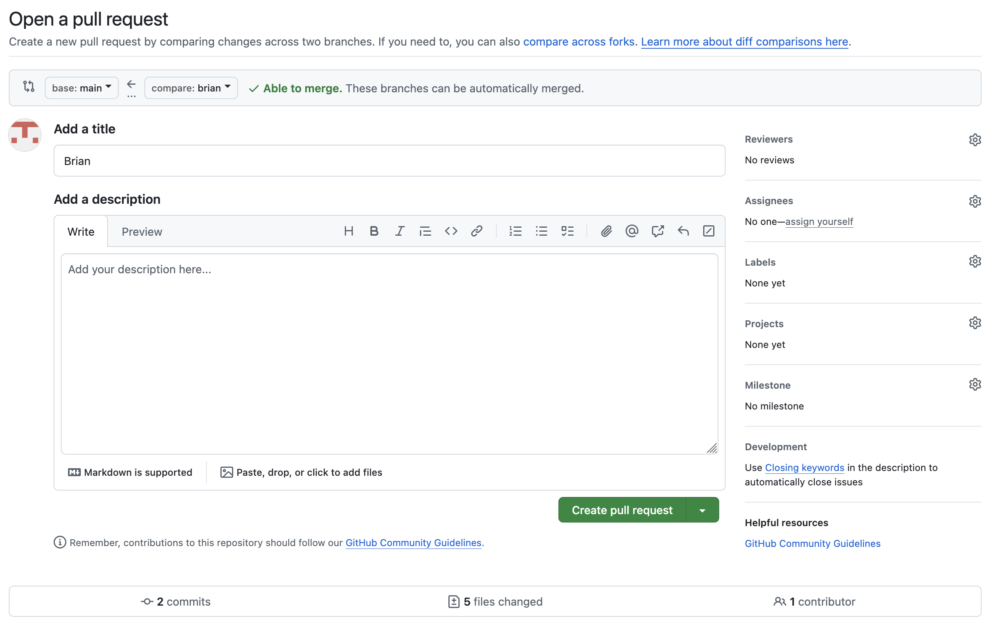

Git Usage
=========

> **Note:**
>
> You may hear about GitHub Desktop, or see the Git integration in VS Code.
> However, the team has found that, at least for when GitHub Desktop is used,
> the code can break. To avoid such occurences, please do not use GitHub
> Desktop. Reading through this can also let you learn more about properly using
> Git and allow you to control Git better.

> **Note 2:**
>
> I do not use Windows, and I do not know much about using it. Thus, I cannot
> support you if you have issues. These instructions may work, but you may have
> to research fixes or workarounds by yourself.

> **Note 3:** This is not a comprehensive guide to Git. This just covers
> everything you need to know to use Git on our team. You will not need to know
> anything else, but if you want to learn more about Git, you may read the [Pro
> Git Book](https://git-scm.com/book/en/v2)


## Git Overview

Git is a version control system. This means that, for a workspace of code, it
stores snapshots of what the codebase looks like at certain points. You may be
used to this concept from applications like Google Docs, in which you can look
at the history of the documents and restore past changes. Git is similar to
these applications, but it has more features and gives you more control over
each snapshot.

Git manages directories called *repositories*. Any directory can be made into a
Git repository. For people who have used an application similar to Google Docs,
you would know that the application saves snapshots every so often. With Git,
these snapshots, or *commits*, are only made manually, and they only contain the
changes that you choose. What your repository looks like at the latest point in
time is called your *workspace*. You are able to swap your workspace for any
commit in your history.

**Refer to this image for the following explanations:**
> ```
>      ┌C─E┬F─
>  A─B─┤  ┌┘
>      └─D┴──G─
> ```

The Git system is usually likened to a tree. Each of the nodes on the graph (A,
B, etc.), represent a *commit*, or a snapshot of the repository. Commits are
meant to be static, not changing and not dependent on future commits.

The paths on the graph should be read from left to right, starting from node A.
The repository is initially at commit A. Then, a commit B is made. At this
point, the repository contains two snapshots of the history, along with the
current file state. When changes are made after B, the file state is called the
*working tree*, as the changes have not been committed yet.

After commit B, the path splits. This is called a *branch*. In a branch, the
changes made are separate from those in another branch. After commits C, D, and
E are made, the only changes in the top branch are those made by C and E. In the
bottom branch, only the changes from D are present. This allows multiple people
to work on the same project without interfering with each other.

Although branches are convenient, in that they allow multiple people to work on
the same task, they are not useful unless you can somehow recombine the changes
made. As it turns out, you can do so with a process called *merging*. You can
merge the changes of one branch into another branch, which will add the changes
from both branches together. This lets you split work into multiple groups, then
merge the changes together once everything is finished. However, sometimes the
changes may conflict, in which case you would have to resolve the merge
manually, choosing what changes to make. We will talk more about merging later.

The line directly after D that connects the two branches represents merging the
bottom branch into the top branch. At commit F, all of the changes from A-E are
present. However, note that the only thing that happened was that the bottom
branch was merged into the top branch. At commit G, only the changes from A, B,
and D are present.


## Create a GitHub Account

1. Go to [GitHub](https://github.com/)

1. Click on the **Sign up** button.

1. Enter your email and click **Continue**.

1. Enter a password and click **Continue**.

1. Enter a username and click **Continue**.

1. Click on **Verify**.

1. Follow the instructions on the screen to match the image direction. Click
   **Submit** after turning the image to the correct direction.

1. A verification code is sent to your email. Check your email and enter the
   verification code on the screen.

1. A login screen is displayed. Follow the prompt on the screen to login to
   GitHub.

1. Follow the prompt on the screen to enter information about yourself. Click
   **Continue** when done.

1. When asked what 2 things you want to do with GitHub, select the following:

   1. Start a new project

   1. Connect with other developers

1. Click **Continue**.

1. Select the free version by clicking on the "**Continue for free**" button.

1. Once your account is created, you’ll be directed to the login screen. Login
   to GitHub.


## Connect with PhantomCatz

1. Once your GitHub account is created, logon to your account if not already
   done so.

1. Notify the your lead to give you access to PhantomCatz’s source code.
   You’ll need to provide your email that you used to sign up for the GitHub
   account.

1. Once the permission is granted, the **PhantomCatz** organization will show up
   in your account’s organization list. Follow these steps to see your
   organization list.

1. From your GitHub account, click on your profile in the upper right corner,
   and select **Your organizations**.

1. Click on **PhantomCatz**.

1. From there, you can navigate to the PhantomCatz’s repositories and source
   code.

## Setup GitHub SSH public key

### Create SSH Key Pair

1. Open the terminal/command line. For Mac, this can be done by opening the
   search menu and typing 'Terminal'. On Windows, click the window icon and
   search for 'Command Prompt'.

1. From the terminal, enter the following:

   `ssh-keygen -t ed25519 -C <github email>`

   * where <github email> is the email you used to create your GitHub account
   * For example: `ssh-keygen -t ed25519 john.doe@gmail.com`

1. You’ll be prompted to enter the following:

   * Enter a file in which to save the key: hit enter to accept the default
     saved location. Default location can be found here:
     * On MacOS, it’ll be saved to $HOME/.ssh/id_ed25519
     * On Windows, it’ll be saved to C:\Users\YOU\.ssh\id_ed25519
   * Enter a passphrase (empty for no passphrase): if you enter a passphrase,
     you’ll need to remember and enter it each time you push up your changes.
     Hit enter twice if you do not wish to enter a passphrase.

1. Your SSH key pair files are created.
   * The two files are public and private key pair used for user authentication.
     * The file with the .pub extension is the public key that will be used when
       uploading files, or setting up GitHub.
     * The file without the .pub extension is a private key, and should NOT be
       shared with anyone.

### Adding Your SSH Key to ssh-agent

1. Open the new `id_ed255519.pub` file in a text editor. Copy the public key
   (all content in this file).
   * Note: the `id_ed25519.pub` file is located in the default location
     mentioned previously.

1. From a web browser, login to GitHub.

1. Click on your GitHub’s profile and select **Settings**.

1. From the left panel, click on **SSH and GPG keys**.

1. Click on the **New SSH key** button.

1. Enter a title.

1. Paste the public key that you’ve copied from step 1 to the **Key** text box.

1. Click on **Add SSH key**.

## Install and Configure Git on Your Computer

1. Go to the [Git website]( https://git-scm.com/downloads) to install Git.
   Follow the instructions for your corresponding OS.
   * For Windows, when you are prompted to select line ending conversions,
     select this option:

     

1. In your terminal, run the following:
   1. `cd`

   1. `git config --global user.name <GitHub username>`
      * Where `<GitHub username>` is the username you used to create your GitHub
        account.
      * For example: `git config --global user.name johndoe`

   1. `git config --global credential.username <GitHub username>`
      * Where `<GitHub username>` is the username you used to create your GitHub
        account. This command is necessary if you have multiple users on the
        computer and you need to switch accounts.
      * For example: `git config --global credential.username johndoe`

   1. `git config --global user.email <email>`
      * where `<email>` is the email you used to create your GitHub account
      * For example: `git config --global user.email john.doe@gmail.com`

   1. `git config --list`
      * Verify the user.name, user.email, and credential.username are set
        correctly. If the information is incorrect, refer to the above steps to
        make the necessary corrections.


## Basics

<code class="command">
git status
</code>

Running the command `git status` will give you the status of the current git
repository. Try to run this on the command line. It should give you a message
like this:

> ```
> fatal: not a git repository (or any of the parent directories): .git
> ```

Why did this happen? It is because we are not in a Git repository. We are only
in a Git repository if the current directory, or any of its parents has, as a
direct child, a `.git` directory. This just means that your directory has to be
a child of a directory containing a `.git` directory. However, you should not
make this directory yourself.

<code class="command">
git init
</code>

To make a directory into a repository, `cd` into it in the terminal and run `git
init`. This creates a subdirectory named `.git`, which contains all of the
information that Git uses. This directory is what Git uses to manage your files,
so if this folder is modified or deleted, Git would not be able to work
properly. Create a directory for this training in a good location, perhaps
putting it in a directory for robotics. `cd` into it in the terminal, then run
`git init`.

Now you can run `git status` again. You should get a message like this:

> ```
> On branch main
>
> No commits yet
>
> nothing to commit (create/copy files and use "git add" to track)
> ```

There is no failure this time, which means that we are now in a Git repository.
But what does each line mean?

The first line states that you are on the branch `main`. This branch is the
initial branch made by Git, like the line containing commits A and B in the
previous example.

Although this is the default branch, you should not work on
this branch. On our team, the `main` branch is meant for releases, not normal
working. To enforce this, pushing to `main` on GitHub is not allowed, and pull
requests require a review. We will cover more about this later.

The second line states that the current workspace has all the changes that
`origin/main` does. `origin` can be thought of as the files on GitHub, and
`origin/main` is the branch `main` on `origin`. However, your computer just
saves a copy of `origin` onto your computer, and it does not automatically
update along with GitHub. This means that when someone else updates GitHub, your
computer will still have the old files until you explicitly tell it to update.
Please remember this, as you may think that you have all the changes, but you
will not know unless you update your repository again.

The last line says that you have no changes that are not committed. This means
that your working tree is empty. We will also cover this topic later.


## Committing

### How to commit

<code class="command">
git commit
</code>

As stated before, commits are snapshots of your code. To make a commit, run the
command `git commit`. However, if you have been following this tutorial, when
you run this command, you will get the following error message:

> ```
> On branch main
>
> Initial commit
>
> nothing to commit (create/copy files and use "git add" to track)
> ```

This message is to the one produced by `git status`. The last line states that
there have been no changes since the last commit (it says 'Initial commit'
because you have not made a commit yet). Try creating a file called `a`. Now,
when you run `commit`, you should get the message

> ```
> On branch main
>
> Initial commit
>
> Untracked files:
>   (use "git add <file>..." to include in what will be committed)
> 	a
>
> nothing added to commit but untracked files present (use "git add" to track)
> ```

Note that the commit still does not work, but new information is shown. To
explain this, we will need to understand how Git tracks files.

### File tracking

Git remembers what files have been added to previous commits. Note that Git only
saves *files*, not *directories*. When you change a file's location or name,
it treats this as a special operation, rather than the creation and deletion of
whole files. This means that you cannot add an empty directory to a Git
repository. The directory structure in Git is only implicitly made by the files
you add, so if you have a directory containing only files that have not been
saved, then the directory containing them will not be saved either.

When you add a file to a commit, the file is *tracked* by Git. When you run `git
status`, you can see three categories of files: untracked, unstaged, and staged
files.

1. Staged files are files that have been prepared for committing. We will talk
   more about staging files later.

2. Unstaged files are files that have been inside a commit before, but the
   changes have not been staged.

3. Untracked files are files that have never been added to a commit and are not
   staged.

<code class="command">
git add
</code>

To stage a file, do `git add PATH/TO/FILE`, where the path is based on your
current working directory. Additionally, you can to `git add PATH/TO/DIRECTORY`
to add all of the files contained inside a directory, including files in
subdirectories.

Create a file named `a`, and try to stage it. Now run `git status`. You should
get this message:

> ```
> On branch main
>
> No commits yet
>
> Changes to be committed:
>   (use "git rm --cached <file>..." to unstage)
> 	new file:   a
> ```

All of the files under the 'Changes to be committed' category are staged files.

When you stage a file, you stage a snapshot of the file at that time. This means
that if you edit the file again, then the changes that were staged are still
just the ones that were made at the moment that you had staged the file. Edit
`a` again and get the status. You should find that `a` is listed twice: once for
the changes you had staged, and again for the change that you just made.

Create a new file called `b`, and put it in a directory called `c`. When you get
the status, you should see this message:

> ```
> On branch main
>
> No commits yet
>
> Changes to be committed:
>   (use "git rm --cached <file>..." to unstage)
> 	new file:   a
>
> Changes not staged for commit:
>   (use "git add <file>..." to update what will be committed)
>   (use "git restore <file>..." to discard changes in working directory)
> 	modified:   a
>
> Untracked files:
>   (use "git add <file>..." to include in what will be committed)
> 	c/
> ```

There are two things of note here:

1. As stated before, the staging you did for `a` the first time was a snapshot
   of what it was *at that time*. As it says, you can run `git restore
   PATH/TO/FILE` to get the state of the file at the time that you had staged
   it. However, this only works for staged files.

2. You can see how the file you just added is untracked. Note that you also
   created a new directory, which has never been tracked either. When you do
   this, Git does not list all of the files contained inside it, but just the
   highest level directory that hasn't been tracked yet.

<code class="command">
git add -A
</code>

A helpful command is `git add -A`, to add all of the files that are contained
inside the repository.

### gitignore file

What if there are certain files that you never want to add to Git, such as
temporary files, log files, or compiled code? To do so, you can make a special
file named `.gitignore` inside a directory, and everything matched by the file
list would be ignored in the status. This means that if a file were to be
changed but it was listed in the gitignore, the status would not list it in the
untracked files. However, note that if a file is already tracked, then the
gitignore will not affect it, and it will always be listed in the status.

Here is a sample `gitignore` file, reproduced below:

> ```
> .DS_Store
> 
> *.html
> !Header.html
> 
> # Ignore build folder
> build
> ```

1. The first item makes all files named '.DS_Store' be ignored by Git. Any file
   name can be listed in the `gitignore`, and these names match files at any
   level of the repository.

1. The second item makes any file that ends in '.html' ignored. This item makes
   use of Unix globbing, where the asterisk ('*') is a stand-in for any number
   (including zero) of characters.

1. The third item starts with '!', and is a negation. This rule states that any
   file named 'Header.html' is *not* ignored, or that it *is* tracked by Git.
   Note that any rule overrides one that is above it. In this case, it overrides
   the '*.html' rule. However, if one were to swap the order of these two, then
   *every* file ending with '.html' would be ignored, even if the name was
   'Header.html'.

1. The *fifth* item makes any files named 'build' ignored. I have been writing
   file, but this was actually just for simplicity. Git will also ignore any
   *directory* named 'build' as well. You should note, again, that these rules
   apply to every level of the repository, not just the top level.

1. Finally, any text that follows a hash ("#"), such as the fourth item, is
   considered a comment, not as a rule (or part of one). Thus, you can write
   lines that describe certain parts of your `gitignore`. Any blank line is also
   not considered as a rule.

### How to commit, part 2

Now that you know how to stage files, you can start committing. At this point,
your status should be like this:

> ```
> Untracked (1)
> ? c/
>
> Unstaged (1)
> M a
>
> Staged (1)
> A a
> ```

From now on, this document will use this notation for the status, as the normal
one is rather verbose. For untracked files, they will be prefixed with `?`.
Files that are tracked and added will be prefixed with `A`. Files that are
tracked and have been modified will be prefixed with `M`. This is not shown, but
tracked files that have been deleted will be prefixed with `D`.

<code class="command">
git status -s
</code>

This text actually comes from a plugin I use, but you can see a view that shows
something similar to this by running `git status -s`. You can find more about
the short form online.

### Adding a Commit Message

Now, try running `git commit`. You should find that your terminal has opened up
an editor that looks like this:

> ```
>
> # Please enter the commit message for your changes. Lines starting
> # with '#' will be ignored, and an empty message aborts the commit.
> #
> # On branch main
> #
> # Initial commit
> #
> # Changes to be committed:
> #	new file:   a
> #
> # Changes not staged for commit:
> #	modified:   a
> #
> # Untracked files:
> #	c/
> #
> ~
> ~
> ~
> ~
> ```

When you make a commit in Git, you have to add a message. Learning this editor
is totally optional, but if you want to do so, you may research more about
*Vim*. Otherwise, read the following:

To get out of the editor, type `ZZ`. Note the caps. You should remember this if
you make a mistake in the future.

<code class="command">
git config core.editor
</code>
<code class="command">
git commit -m
</code>

You have two options:

1. You can set the default editor for Git to something else. This is highly
   recommended, as this method allows for more control over the commit messages.
   It also gives more information than the other option.

   > ```
   > git config --global core.editor "nano"
   > ```

   Nano is an editor that is simpler to use than Vim. It will likely be on your
   machine if you use Mac or Linux.

   You can replace `nano` with `code --wait` if you have set up your VS Code
   correctly, which opens the Git commit with VS Code. This may be over-the-top,
   though.

   The text in the double quotes is the command that is run to edit the file.
   Thus, if you set the command to a command like `cat`, it would just give you
   the contents of the file. You can experiment with this yourself and search
   online on how to use your favorite editor.

2. You can use the `-m` flag. Again, this method is not recommended. However,
   you can write `git commit -m 'MESSAGE'` to write the commit message as
   `MESSAGE`.

### Logging

<code class="command">
git log
</code>

Make a commit with the message 'Made a'. You should now have one commit in your
history. You can check this by running `git log`. Each commit message will look
different, but it should follow this format:

1. `commit`, followed by a long hash
2. `Author`, followed by your name, followed by your email in angled brackets
3. `Date`, followed by the time you made the commit
4. The commit message you just wrote

This log should give you all of the information you need to do further work
regarding a commit. Most notably, the commit hash can be used to refer to a
specific commit in your history. Git allows you to replace any usage of a hash
with just a part of the start, as long as that can refer to a unique commit. If
this is too difficult to use, then Git has another option: the latest commit is
referred to as `HEAD~0`, the commit before that is `HEAD~1`, and so on.

With more commits, your log will grow larger, but you can still search through
it to find what you need if the commit messages are good.

### Amending

<code class="command">
git commit --amend
</code>

If you mess up a commit, like forgetting to stage files or messing up the
message, you can edit the commit as long as you don't push the commit. You can
do so with the command `git commit --amend`, which allows you to edit the last
commit you made.

When you just run this command, you will redo your last commit with the
additional changes that you have staged. Suppose you commit, but you forgot to
add a file:

> ```
> git commit -m 'commit 1'
> git add FORGOTTEN_FILE
> git commit --amend
> ```

This process will add the file to the commit, making it seem as it was always
added. At this point, it will give you a chance to rewrite the commit message.

You should note that this will have issues if you try to amend a commit that has
already been pushed to GitHub. You should only amend commits that are fully
local.

### Resetting

To remove a file from the stage, you can use `git reset`. Suppose your status
looks like this:

> ```
> Staged (1)
> M a
> ```

Then, you can run `git reset a`, which would make it become

> ```
> Unstaged (1)
> M a
> ```

<code class="command">
git reset
</code>

This command is useful, as you can select exactly what you want to commit at one
time, and you can modify what has been staged before you commit. Note that you
can write multiple file names after the command and reset as many files as you
want. For example, `git reset a b c/d` will remove files `a`, `b`, and `c/d`
from the stage.


## Cloning

<code class="command">
git clone
</code>

You know how to make your own repository, but what if you want to use one that
already exists? You can do so by *cloning* it. Git by itself cannot share files,
but by using a host site like GitHub, we can share a single repository across
the whole team.

To clone a Git repository from GitHub:

1. Go to the repository on GitHub

2. Click the arrow on the green 'Code' button, and look under 'Local'. It should
   say 'Clone' under it.

3. Some options may appear:

   1. HTTP

   1. SSH

   1. GitHub CLI

   If you are on a Unix-based system (typically anything but Windows), you
   should use the link for SSH.

   If you are on Windows, use the link for HTTPS. The option for SSH may not
   show up or work.

   Click the corresponding tab and copy the link it gives you.

4. Open your terminal, and `cd` to the directory into which you want to clone
   the repository.

5. Enter `git clone `, and then the link that you just copied. There should be a
   space between `clone` and the link.

   If your screen freezes for a long time, then press `<C-c>`. This will stop
   the execution. This will likely occur if you are connected to the school wifi
   and using SSH. We are not sure how to solve this, but you can connect to your
   phone's hotspot and run the git commands.

   If you do not want to waste data downloading the whole database, you can do
   the following:

   1. Retry cloning using the HTTPS link.

   2. Go into the repository. You can do this from the terminal, or use the
      native file explorer.

      * For Unix, do `ls -la`. This shows hidden files and displays them in a
        readable list

      * For Windows, do `dir /a`.

   3. Do `git config remote.origin.url <URL>`, where '`<URl>`' is the SSH link
      to the repository, found in the same place as the previous link.

   Although you can clone through HTTPS, you will likely not be able to do much
   more with it, unless you are on Windows.

Now that you have cloned the repository, there is a **copy** stored on your
machine. Note that this is just a copy. If you want to have your changes on
GitHub, you have to update it manually. We will talk more about updating later.


## Branching

As stated before, you can make branches in Git. You can do this with the `git
branch NAME` command, to create a branch with the name `NAME`. Note that adding
a name is necessary.

This command creates a branch based off of your current commit. As you have
read, this means that it has all of the commits up to and including your latest
commit. However, it will not be changed when another branch makes additional
changes.

Run `git branch branch2`. This will make a new branch called `branch2` off of
your last commit. If it ran successfully, then there should be no output.

Get your status. Note that, although you have created the branch, you are still
on the `main` branch. You have to switch to the branch first.

You can do so by using `git switch branch2`. The command `switch` changes
the files in your workspace to match that of the branch you are switching to.

If you have uncommitted changes, then Git will not let you switch. This is
because you will lose your changes when you run `switch`. You can save your
changes by committing, but you may not want to make a commit. If this is the
case, then you can *stash* your changes.

### Stashing your changes

To stash any unsaved changes, run the command `git stash`. This command stores
all of your changes on tracked files since your last commit on the current
branch. Suppose your workspace looks like this:

> ```
> Untracked (1)
> ? c/
> 
> Unstaged (1)
> M a
> ```

When you run `stash`, you should get this a message like this:

> ```
> Saved working directory and index state WIP on main: 03e7c3b Made a
> ```

The last part of this line is the commit hash and message of the latest commit.

When you run `status` again, you should find that the tracked changes are no
longer listed, but the untracked ones are still there. Git does not affect
untracked files. The tracked changes are stored in a 'stash', which you can view
by running `git stash list`. If you run this command, you should see that there
is one stash in your current workspace.

Now that you have stashed, you should be able to switch to another branch. If
you run `status` again, you will find that the untracked files have not been
modified. Again, this is because Git does not touch the untracked changes. If
you do not want to see them in the status, you should `add` them or put them in
the `gitignore` file.


## Fetching Changes from GitHub

When people make new changes on GitHub, you have to download them first before
you can use them on your own machine. This can be done with the command `git
fetch origin`. This command adds the files in the remote repository to your
machine, but it does not replace those in your workspace. This is because it
stores the files in a separate area from your workspace.

To update the files in your workspace, you should run the command `git merge
origin/main`. This command attempts to merge the `main` branch from `origin`.
The `origin` name refers to the files stored on GitHub, so merging the files
from there would effectively cause your files to be updated.


## Undoing Changes

Sometimes, you may make a mistake and want to undo what you had done. There are
a few ways to do so.

### Aborting Actions

You can abort a commit while writing a message by providing an empty message.
Note that when using `git commit -m`, you cannot see what changes you have made
on the commit while writing the message. This is why is is highly recommended to
use a real text editor to make your commits. Doing so also allows you to make
multi-line commit messages. When you write the commit message, you should always
make sure that you are committing exactly what you want.

When you write the commit with an empty message, it should tell you that the
commit has been aborted.

If you start a merge, but you realise that you want to stop merging, you can
abort the merging process. When you start a merge, but there is a conflict, it
stops before making the commit. However, you can have it always pause before
committing with the flag `--no-commit`, i.e. running `git merge --no-commit
<args>`.

When you have not finished a merge, and you want to abort it, run `git merge
--abort`. This will roll back your changes to the commit before the merge. This
is partly why you have to have no unsaved changes when you commit, as Git cannot
revert to your previous workspace without fail. This command allows you to undo
a merge while in it, so that you don't break something with a merge.

### Resetting

You have learned that the `reset` command can remove files from the stage.
However, you can also roll back files to what they were in a previous commit.

You can do this using the command `git checkout --`, followed by any number of
files. This command will overwrite the contents of files in your current
workspace, and it is irreversible. Thus, you should be very careful when using
it. To show how this works, here is an example:

Suppose your workspace is this:

> ```
> Unstaged (3)
> M f1
> M f2
> M f3
> ```

After running `git checkout -- f1`, the contents of `f1` would be what they were
on your previous commit, and your status would look like this:

> ```
> Unstaged (2)
> M f2
> M f3
> ```

Running `git checkout -- f2 f3` would make the contents of both `f2` and `f3` be
what they were when you made the last commit.

If you put the hash of a commit before the `--`, Git will pull the files from
the commit you specified instead of the last one. If the file was not tracked in
that commit, Git will give an error instead of deleting your file.

You can reset your whole branch with `git reset --hard`. With this command, you
must specify a whole commit, not an individual file. This command, unlike
`checkout`, puts your branch at the state of the specified commit. This means
that, when resetting to a prior commit, any later commits are not in the commit
log. This command is **very** dangerous, as you cannot recover the overwritten
files. Please make sure you know what you are doing when you use this command.

Suppose your commit history looks like this, and the commit hashes are the
letter of the commit:

> ```
> A─B─C─D─E
>         ^
>         HEAD
> ```

Then, when you run `git reset --hard C`, your history will be


> ```
> A─B─C
>     ^
>     HEAD
> ```

This also has the exact state of the files at commit C. Your branch would not
contain the commits D or E in its log, and you would lose any changes made after
C.

When referring to a previous commit, there is a shorthand notation. `HEAD`
refers to the latest commit, `HEAD~1` refers to the commit before that, and so
on. Note that this will only take the commits from the current branch. You can
find the order that commits are placed in with `git log`. Thus, if your HEAD was
commit E, running `git reset --hard HEAD~2` would have the same effect as the
previous command.

### Reflog

Using the standard log is good for undoing a commit, but what if you wanted to
undo a command? For this, you can use the reflog, which shows a list of commands
made and a list of references to them. You can access this by running `git
reflog`. This will give you a list that looks something like this:

> ```
> 625fe11 HEAD@{0}: merge branch2: Merge made by the 'ort' strategy.
> 5b75216 HEAD@{1}: commit: Made some changes
> 03e7c3b HEAD@{2}: reset: moving to HEAD@{1}
> ba2afd1 HEAD@{3}: merge branch2: Fast-forward
> 03e7c3b HEAD@{4}: checkout: moving from branch2 to main
> ba2afd1 HEAD@{5}: reset: moving to HEAD
> ba2afd1 HEAD@{6}: commit: Made some changes
> 03e7c3b HEAD@{7}: reset: moving to HEAD
> 03e7c3b HEAD@{8}: checkout: moving from main to branch2
> 03e7c3b HEAD@{9}: reset: moving to HEAD
> 03e7c3b HEAD@{10}: reset: moving to HEAD
> 03e7c3b HEAD@{11}: commit (initial): Made a
> ```

This list shows two columns on the left-hand side. The leftmost one is the
commit hash that HEAD is on after the command, i.e. your current workspace. The
one on the right is the name of that reference.

Running the command `git reset --hard HEAD@{1}` will roll back the changes to
the state right after that commit was made. This command allows you to undo a
reset or most other commands. The commands that you cannot undo are small
changes, such as amends, cancelled (aborted) commands, or commands that
overwrite what is in your workspace. Even if you can use this command, you
should be careful not to lose your progress.

### Rebase

You can modify your commit history with `git rebase`. You should typically not
need this command, and **it should not be used for commits already pushed to
GitHub**. This command makes everybody have to re-download the changes from
GitHub, you should **only** use it for local changes.


## Pushing Changes

If you were working completely alone, only on your machine, then just using Git
would be enough to manage your files. Unfortunately, the team has multiple
people on it, and thus you have to share your work with others. When you finish
your work, you want to push your changes to GitHub, allowing others to see what
you have done.

You can push your changes by running `git push`. This command will try to update
the commits in the remote repository with the latest from your workspace.
However, if there is a conflict, the push will fail. You can run
`git push --force` to force GitHub to use the commits in your workspace, but
this is rarely needed and should not be used normally. If you see an error, it
likely means that you do not have the latest code from GitHub. Instead of
forcing the push, try to update your local repo first, using `fetch`.

### Making a PR

When you use `push`, it tries to add all of the commits from your workspace into
the remote repository. However, you should only be working on your own branch,
and, if the repository is set up correctly, you shouldn't be allowed to push to
the `main` branch. Thus, when you push, the only code that should change on
GitHub is that which is on your own branch. To add your changes to `main`, you
have to make a pull request (PR).



Click on the 'Pull requests' tab, and choose to make a 'New pull request' (Green
button). This will open a selection, where you should choose your branch, which
will, in turn, bring you to a screen where you can write a pull request. Here is
a sample picture of when I tried to make a new pull request.



There are a few things you should fill out:

1. Title: This should follow the style guide for writing PR's. Typically, you
   would just write a few words on what the change was.

2. Description: This should be used to describe any of the other changes you
   made. You should not be describing why you made the change.

3. Reviewers: Pull requests require a peer-review before they are accepted.
   Typically, your lead should review all your code, but someone else may be
   able to do it. You should select the person who would review your code.

When you finish writing your PR, you should submit it and notify your lead and
whoever is reviewing your code.

## Merging

As explained before, you can merge the main branch into your own workspace by
doing `git merge`. This will normally succeed without conflicts, and all you
would have to know is that it updates your workspace with the latest code from
`main`.

Restating what it does, `merge` adds all of the changes from the specified
branch into your current workspace. Thus, if you had two local branches, you
could rectify them into one branch by using `merge`. For example, if you had
branches `a` and `b`, and you wanted to have the changes made in the `b` branch
in the `a` branch, you could run `git merge b` while on the `a` branch (Recall
that the command to switch to this branch would be `git switch a`). The effect
of running this command would be that the commits on `b` would be able to be
seen in `a`, and all of the changes from those would be added as well.

When I say 'changes', I mean lines that differ in the code. Each branch should
have a common ancestor (or, at least, the initial commit). Git compares each
file in the target branch (ours) to the source branch (theirs) and applies the
additions and deletions. You should note that Git views differences as linewise;
if a line is different in any way from another, they are considered different.
Thus, even minor changes, such as changing the indentation, would be viewed by
Git as making a change.

As this is the case, it would be very easy to have your changes overlap with
those of someone else's. Git is not able to manage merging these changes 


> # This could be implemented next year
> 
> ## Git Conventions and Standards
> 
> ### Commits
> 
> 1. Name your commits by this standard:
>    1. New features should start with `feat:`, or `feat(topic):`
>       * New features are things that are wholly new or add new functionality
>         to something old
>    1. Bug fixes should start with `fix:`
>       * Fixes should not add new functionality
>    1. Refactoring should start with `refactor:`
>       * Refactoring should not fix bugs or add new features, but make an
>         existing part more extensible
>    1. Documentation should start with `docs:`
>       * This is for when you add documentation to anything
> 
>    You can have multiple of the above in a single commit, but you must list
>    all of the ones that apply. If you create a new feature and add
>    documentation for it, you should have a field for `feat` and a field for
>    `docs`.
> 
> ### Branches
> 
> 1. Use your dev branch for things that are not tracked by issues.
> 1. Create a separate branch for each issue, merge it into your dev branch, and
>    merge your dev branch into `main`
